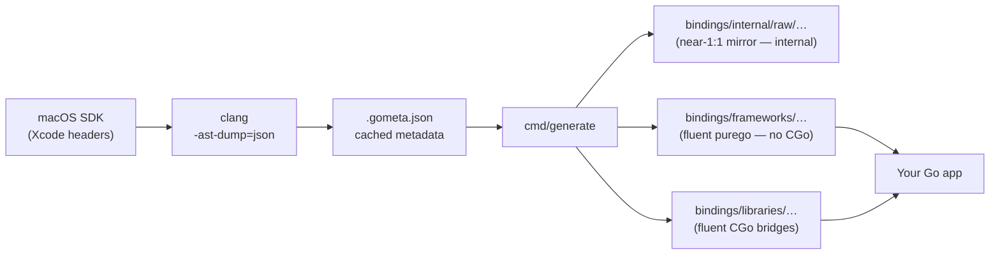
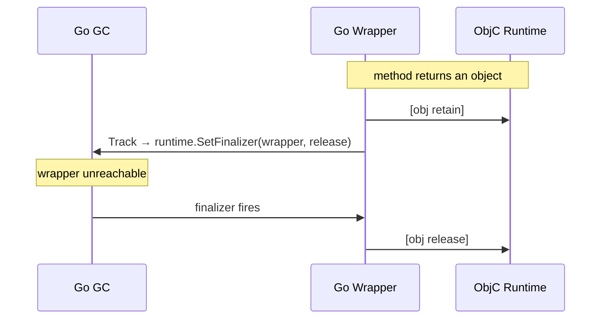
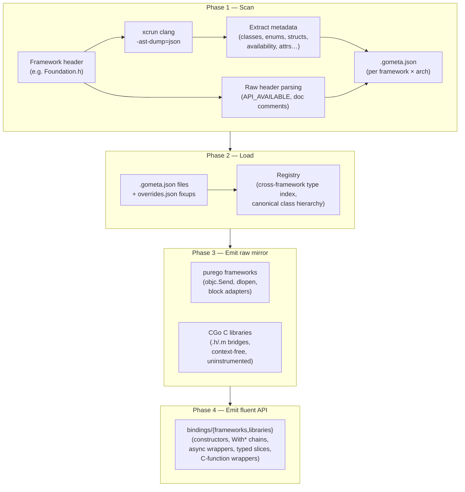

# go-bindings-macosplatform

[](https://pkg.go.dev/github.com/deploymenttheory/go-bindings-macosplatform)
[](LICENSE)
[](https://go.dev/)
[](https://github.com/deploymenttheory/go-bindings-macosplatform/releases)
[](https://codecov.io/gh/deploymenttheory/go-bindings-macosplatform)


Type-safe Go bindings for native macOS framework APIs, generated directly from the installed version of the Xcode SDK on macOS deterministically.

This project provides two things:

- A **code generator** that introspects macOS SDK headers via Clang and produces idiomatic Go packages — ObjC frameworks are bound through [purego](https://github.com/ebitengine/purego) (no CGo, no Xcode needed to build your app), and Apple C libraries are bound through CGo bridges.
- The **generated bindings** themselves — one fluent, Go-shaped package per SDK surface, ready to import: 252 ObjC frameworks (`bindings/frameworks/`) and 16 Apple C libraries (`bindings/libraries/`) discovered in the macOS SDK. Constructors bundle `alloc`+`init`, properties become chainable `With*` setters, async completion handlers become `func(ctx) error`, `NSArray` getters become typed Go slices, and C functions get prefix-stripped Go names. Subclasses **embed their base** (inheriting its methods through Go promotion); an abstract base's setters accept a **sealed provider interface** so only real members of the hierarchy type-check; abstract bases emit no meaningless constructor; multi-value methods use **named returns**; and each package's `doc.go` carries a type index so `go doc` reads like a manual. Calls that Apple isolates to the **main thread** (`@MainActor` — AppKit and everything that inherits from it, like `MKMapView`) are wrapped in `purego.Main` **automatically**, so UI code is correct without the caller remembering to dispatch.

> **One consumable API.** These fluent packages are the *only* API you import. A lower-level "raw" binding (a near-1:1 purego/CGo mirror of the ObjC/C surface) is still generated as the implementation substrate, but it lives under `bindings/internal/raw/` — Go's internal-package rule makes it unreachable from outside this module. You never import it, and the compiler guarantees it.

> **Platform:** macOS only (`darwin`). All generated code carries a `//go:build darwin` constraint.

---

## Documentation

| Guide | Description |
| --- | --- |
| [Developer Guide](docs/developer_guide.md) | Build macOS apps with the SDK — app lifecycle, windows, menus, VM management, blocks, and more |
| [Idiomatic Layer](docs/opinionated_library.md) | How the fluent API is shaped, its benefits, and before/after comparisons against the raw ObjC/C surface |
| [Idiomatic Migration](docs/idiomatic-migration.md) | What changed when the idiomatic layer became the sole `bindings/` API, and how to update imports |
| [Extraction Workflow](docs/extraction_workflow.md) | How Clang AST scanning produces `.gometa.json` files and how those drive Go code generation |
| [Naming Standard](docs/naming.md) | The naming contract for generator code and generated identifiers |
| [Metadata Overrides](docs/metadata_overrides.md) | Declarative per-framework metadata corrections applied at load time |

---

## Quick Start

Add the module to your project:

```sh
go get github.com/deploymenttheory/go-bindings-macosplatform
```

Import whichever frameworks you need and use the generated types directly. ObjC framework packages are pure Go — the framework dylib is loaded at runtime via `dlopen`, so no CGo toolchain is required to compile against them:

```go
package main

import (
    "fmt"

    "github.com/deploymenttheory/go-bindings-macosplatform/bindings/frameworks/foundation"
)

func main() {
    // ObjC class methods become package-level functions: +[NSProcessInfo processInfo]
    info := foundation.NSProcessInfoProcessInfo() // *foundation.ProcessInfo
    fmt.Println(info.ProcessIdentifier(), info.ProcessorCount())

    // Go strings convert at the boundary: -[NSString initWithUTF8String:]
    s := foundation.NewStringWithUTF8String("Hello, macOS") // *foundation.String
    fmt.Println(s.Length()) // 12
}
```

The idiomatic layer trades a raw 1:1 mirror for fluency. Each `With*` setter returns the
receiver, so configuration reads as a single expression, and setters accept *sealed*
provider interfaces so only a real member of a class hierarchy type-checks:

```go
import vz "github.com/deploymenttheory/go-bindings-macosplatform/bindings/frameworks/virtualization"

config := vz.NewVirtualMachineConfiguration().
    WithBootLoader(vz.NewLinuxBootLoaderWithKernelURL("/var/vm/vmlinuz")).
    WithCPUCount(2).
    WithMemorySize(2 << 30)

// WithBootLoader accepts vz.BootLoaderProvider — only VZBootLoader subclasses
// satisfy it, so passing a non-boot-loader is a compile error, not a runtime panic.
```

---

## Contents

- [Documentation](#documentation)
- [How It Works](#how-it-works)
- [Prerequisites](#prerequisites)
- [Using the Generated Bindings](#using-the-generated-bindings)
  - [Import Paths](#import-paths)
  - [Object Model](#object-model)
  - [C Functions](#c-functions)
  - [Memory Management](#memory-management)
  - [ObjC Blocks](#objc-blocks)
  - [Error Handling](#error-handling)
  - [Main Thread Dispatch](#main-thread-dispatch)
- [Generating Bindings](#generating-bindings)
  - [CLI Reference](#cli-reference)
  - [Pipeline Phases](#pipeline-phases)
- [Architecture](#architecture)
  - [Repository Layout](#repository-layout)
  - [Two Emission Pipelines](#two-emission-pipelines)
  - [Runtime Layer](#runtime-layer)
  - [Generated Package Structure](#generated-package-structure)
  - [Generated Code Annotations](#generated-code-annotations)
  - [Metadata QA](#metadata-qa)
- [Framework Coverage](#framework-coverage)
- [Known Limitations](#known-limitations)
- [Contributing](#contributing)
- [License](#license)

---

## How It Works



The generator uses Clang to dump the full AST of each framework header, extracts metadata (classes, protocols, enums, structs, free functions, extern constants, block types, availability windows, deprecation messages, and doc comments) into JSON, and then emits Go source files.

ObjC frameworks are emitted as **pure Go** packages: classes resolve via `objc_getClass`, methods dispatch through `objc.Send`, and the framework dylib is `dlopen`ed lazily at package init. Apple C libraries (EndpointSecurity, xpc, dispatch, …) are emitted as **CGo** packages with generated `.h`/`.m` bridge files. Both surfaces are emitted twice — once as the internal raw mirror and once as the fluent `bindings/` API layered on top of it — from the same scanned metadata.

The result is a set of Go packages where every Objective-C class becomes a Go struct, selectors become Go methods, inheritance is modelled via struct embedding, and C functions become exported Go functions — all with automatic memory management through Go finalizers.

---

## Prerequisites

| Requirement | Version | Notes |
| --- | --- | --- |
| macOS | 13+ (Ventura) | Required for framework dylibs and the Objective-C runtime |
| Go | 1.26.2+ | Generics required for parameterised types (e.g. `NSArray[T]`) |
| Xcode Command Line Tools | Latest | Required only for `scan` (Clang/SDK headers) and for building apps that import the CGo `bindings/libraries/` packages |

Install Xcode Command Line Tools if you haven't already:

```sh
xcode-select --install
```

Verify Clang is available via `xcrun`:

```sh
xcrun clang --version
```

**External dependencies:** `github.com/ebitengine/purego` is the only runtime dependency — it provides `dlopen`, `objc_msgSend` dispatch, and block support without CGo. Both the framework packages and the C-library packages run on it. The only other entry in `go.mod` is `gopkg.in/yaml.v3`, used by in-repo generator tooling, not the bindings.

---

## Using the Generated Bindings

### Import Paths

Each macOS framework maps to a Go package under `bindings/frameworks/`, and Apple C libraries map to `bindings/libraries/`:

```go
import (
    "github.com/deploymenttheory/go-bindings-macosplatform/bindings/frameworks/foundation"
    "github.com/deploymenttheory/go-bindings-macosplatform/bindings/frameworks/vmnet"
    "github.com/deploymenttheory/go-bindings-macosplatform/bindings/libraries/xpc"
)
```

These are the only packages you import. Available packages mirror the frameworks in this repository — see [Framework Coverage](#framework-coverage) for the categories covered.

### Object Model

Every Objective-C class is a Go struct, named without the framework's two-letter prefix (`NSString` → `foundation.String`, `NSMutableString` → `foundation.MutableString`). Superclass relationships are modelled using struct embedding, giving you inherited methods directly on the subtype:

```go
// MutableString embeds String which embeds Object
type MutableString struct {
    String
}

// Methods from Object and String are promoted automatically
var s *foundation.MutableString
_ = s.Length() // String method, available via embedding
```

**Constructors:** an ObjC `alloc`+`init…` pair is bundled into a single `New…` function, and an ObjC class method (e.g. `+[NSProcessInfo processInfo]`) is generated as a package-level function named after its class and selector:

```go
// -[NSString initWithUTF8String:] → NewStringWithUTF8String
s := foundation.NewStringWithUTF8String("hello")

// +[NSProcessInfo processInfo] → NSProcessInfoProcessInfo
info := foundation.NSProcessInfoProcessInfo()
```

Abstract base classes emit *no* constructor (there is nothing to instantiate); a concrete subclass provides one.

**Wrapping a raw object id:** If you hold a raw `objc.ID` (from a block callback, or an XPC/dispatch pointer), wrap it with the generated `<Type>FromID` constructor. This registers a Go finalizer so the underlying ObjC object is released when the Go wrapper is collected:

```go
str := foundation.StringFromID(id) // nil if id == 0
```

> `FromID` registers a *releasing* finalizer but does **not** retain — retain first (`purego.Retain(id)`) if you don't own a +1 reference.

**Containers:** Objective-C collections are concrete Go types whose element accessors return a runtime object handle (`obj.Object`); check its type with `IsKind` before treating it as a specific class:

```go
arr := someAPI.Items()          // *foundation.Array
count := arr.Count()            // int
first := arr.ObjectAtIndex(0)   // obj.Object
if first.IsKind("NSString") {
    fmt.Println(first.Description())
}
```

**Protocols** are emitted as plain Go interfaces (`foundation.NSCopyingProtocol`, …) for typing and duck-typed acceptance. Delegate protocols get a richer interface you can implement.

### C Functions

Free C functions are exported with Go-style names, with the library prefix stripped: `vmnet_start_interface` becomes `vmnet.StartInterface`, `vmnet_interface_add_ip_port_forwarding_rule` becomes `vmnet.InterfaceAddIpPortForwardingRule`. The original C symbol is recorded in a doc comment.

```go
// C function: vmnet_start_interface
iface := vmnet.StartInterface(desc, queue, handler)
```

Functions with a `CFErrorRef *`/`NSError **` out-parameter return an idiomatic `error` as their last value instead of the pointer-out shape.

**Symbol availability:** some headers declare functions that have no dylib export (header-inline helpers, or symbols removed in newer macOS releases). Every generated framework package exposes a guard — calling a wrapper whose symbol failed to bind panics on a nil function variable, so probe first when in doubt:

```go
if !vmnet.SymbolAvailable("vmnet_start_interface") {
    return errors.New("vmnet unavailable on this system")
}
```

### Memory Management

Object-returning methods retain the result (+1) and `FromID` constructors register a Go finalizer; when the GC collects the Go wrapper, the underlying Objective-C object is released. In most cases you do not need to manage memory manually.



In the CGo `bindings/libraries/` packages, Objective-C ARC is **disabled** in all bridge files (`-fno-objc-arc`); reference counting is likewise driven from the Go side so the two runtimes never fight over ownership.

### ObjC Blocks

APIs that accept block callbacks take plain Go closures. The generated code wraps the closure in a real ObjC block object via `objc.NewBlock`, converts the callback arguments (object ids are retained and wrapped, `char*` becomes `string`), and releases the block after the call — escaping completion handlers stay alive because the callee copies them. Async APIs whose block is a single completion handler collapse to a `func(ctx) error`-shaped Go call.

Block signatures whose components cannot cross purego's callback ABI (struct-by-value arguments, protocol interfaces, float returns) degrade to an `objc.Block` parameter instead — construct the block yourself with `objc.NewBlock` for those. Every degradation is recorded in the committed diagnostics baseline.

The CGo C-library packages use generated block trampolines (`bindings/runtime/blocks`) for the same effect — you still just pass a Go closure.

### Error Handling

**ObjC errors as Go errors:** Methods with an `NSError **` out-parameter return a Go `error` as their last value, carrying the structured NSError domain, code, description, and failure reason. A `BOOL`-returning error method collapses to a plain `error`:

```go
data, err := foundation.NewDataFromFile("/etc/hosts", 0)
if err != nil {
    log.Fatal(err) // structured: domain, code, description, failure reason
}
_ = data
```

C functions with `CFErrorRef *` out-parameters return `(result, error)` with the CFError converted via its toll-free NSError bridge.

**ObjC exceptions:** the CGo `bindings/libraries/` packages wrap every call in `@try`/`@catch` and re-raise exceptions as Go panics. The purego `bindings/frameworks/` packages do **not** intercept ObjC exceptions — an uncaught `NSException` terminates the process, as it would in an ObjC program.

### Main Thread Dispatch

All AppKit (and generally all UI-related) calls **must run on the macOS main thread**. Failure to do so causes undefined behaviour and crashes.

**The bindings handle this for you.** Apple isolates UI APIs to Swift's `@MainActor`; that isolation is harvested from the Swift symbol graph and propagated down the class hierarchy, so every method, `With*` setter, and constructor of a main-thread-bound class — `NSWindow`, `NSView`, and everything that inherits from them, including `MKMapView`, `PDFView`, `SCNView` in other frameworks — is wrapped in `purego.Main` automatically. When you already hold the main thread the wrapper runs inline (no dispatch), so there is no cost on the hot path and no deadlock. Queue-based frameworks (Virtualization, Core Data) are left untouched, since they require a consistent serial queue rather than the main thread.

You remain responsible for the app's main-thread *structure*, though — lock the main goroutine to the main OS thread, hand it to the AppKit run loop (so the main queue is actually serviced), and dispatch your own non-binding main-thread work via the `mainthread` helper package (pure Go, GCD main queue under the hood):

```go
import (
    "runtime"

    "github.com/deploymenttheory/go-bindings-macosplatform/bindings/frameworks/appkit"
    "github.com/deploymenttheory/go-bindings-macosplatform/opinionated/tools/grandcentraldispatch/mainthread"
)

func init() { runtime.LockOSThread() }

func main() {
    go func() {
        mainthread.Do(func() {
            // UI work — runs on the main thread, Do blocks until it returns
        })
    }()

    appkit.SharedApplication().Run() // run loop drains the main queue
}
```

`mainthread.Do` runs inline when already on the main thread (avoiding the dispatch-to-self deadlock), and `mainthread.IsMain()` reports which thread you're on. Note that dispatched work only executes while the main thread services its run loop — `NSApplication.Run`, a CFRunLoop, or `dispatch_main`. Lower-level GCD access is available via the `bindings/libraries/dispatch` package.

---

## Generating Bindings

The generator lives in `cmd/generate` and uses a subcommand interface. Run it with `go run`:

```sh
go run ./cmd/generate/ <subcommand> [flags]
```

### CLI Reference

| Subcommand | Description |
| --- | --- |
| `scan` | Invoke Clang on SDK headers and write `.gometa.json` metadata (requires Xcode) |
| `bindings` | Re-emit the internal raw mirror from committed metadata: purego ObjC frameworks + CGo C libraries → `bindings/internal/raw/` (no Clang needed) |
| `idiomatic` | Re-emit the fluent consumable layer → `bindings/frameworks/` + `bindings/libraries/` |
| `parity` | Report (and ratchet) any construct the raw mirror emits that the fluent layer does not |
| `class-hierarchy` | Derive the canonical ObjC class hierarchy → `metadata/objcclasshierarchy/` |
| `all` | Run scan (optional) + raw `bindings` in sequence (then run `idiomatic` to refresh the consumable layer) |
| `validate` | Structural integrity checks over committed metadata (runs in CI) |
| `diff` | Semantic API diff between two metadata trees (for reviewable SDK bumps) |
| `list` | List all frameworks the installed SDK exposes and exit |

**Common flags:**

| Flag | Description |
| --- | --- |
| `--framework <name\|all\|A,B,...>` | Framework(s) to operate on. Use `all` for every SDK framework. |
| `--diagnostics-baseline <file>` | Fail if regeneration produces a type degradation not in the committed baseline (CI ratchet) |
| `--diagnostics <file>` | Rewrite the diagnostics baseline (deliberate, reviewed change) |
| `-v` | Verbose output (type degradations, cycle breaks) |

**Common workflows:**

```sh
# Re-emit everything from committed metadata (fast — no Clang, no Xcode required):
#   raw mirror → bindings/internal/raw/ ; fluent API → bindings/{frameworks,libraries}
go run ./cmd/generate/ bindings
go run ./cmd/generate/ idiomatic

# Re-emit the raw mirror and enforce the committed diagnostics baseline (what CI runs)
go run ./cmd/generate/ bindings --diagnostics-baseline metadata/diagnostics-baseline.json

# Prove the fluent layer covers everything the raw mirror emits
go run ./cmd/generate/ parity

# Re-emit the fluent layer for one framework
go run ./cmd/generate/ idiomatic --framework Virtualization

# Scan a single framework and write .gometa.json to metadata/ (requires Xcode)
go run ./cmd/generate/ scan --framework Foundation

# Scan + generate everything for one framework, or the whole SDK
go run ./cmd/generate/ all --framework Foundation
go run ./cmd/generate/ all --framework all

# Validate committed metadata / diff two metadata trees
go run ./cmd/generate/ validate
go run ./cmd/generate/ diff --old /tmp/old/metadata --new ./metadata

# List all frameworks the current SDK exposes
go run ./cmd/generate/ list
```

> **Tip:** The repository ships with pre-built `.gometa.json` files for all discovered frameworks in `metadata/`. This means `go run ./cmd/generate/ bindings && go run ./cmd/generate/ idiomatic` is the fast everyday path — no Xcode or Clang invocation needed.

### Pipeline Phases



**Phase 1 — Scan:** For each framework, invokes `xcrun clang -x objective-c -ast-dump=json` against the umbrella header. The AST is walked to extract classes, protocols, enums, structs, free functions, extern constants, and block types. Availability annotations (`API_AVAILABLE`, `API_DEPRECATED`, …) and doc comments are parsed from the raw SDK header source using the AST-reported line numbers as anchors — required because Apple clang 21+ (Xcode 26.x) no longer embeds platform/version data inside `AvailabilityAttr` JSON nodes. Apple C libraries that live under `{SDK}/usr/include/` rather than `System/Library/Frameworks/` (EndpointSecurity, xpc, dispatch, …) are registered in `metadata/clibraries.json`.

**Phase 2 — Load:** All `.gometa.json` files are read and merged into a `Registry` that indexes every known class, its owning framework, and whether it uses generics. Canonical ownership is determined by the "fewest non-zero methods wins" heuristic; declarative per-framework fixups in `metadata/<kind>/<name>/overrides.json` are applied so committed metadata stays pure scanned output. When metadata exists for multiple architectures, `arm64` is preferred.

**Phase 3 — Emit raw mirror:** ObjC frameworks are emitted as purego packages in topological dependency order under `bindings/internal/raw/frameworks/`; mutual-import cycles are detected via DFS and broken by degrading the cross-framework reference to `objc.ID`. C libraries are emitted as CGo packages with generated bridge files under `bindings/internal/raw/libraries/`. Every type degradation is collected and checked against `metadata/diagnostics-baseline.json` — new degradations fail CI until deliberately accepted.

**Phase 4 — Emit fluent API:** The `idiomatic` subcommand emits the consumable `bindings/frameworks/` + `bindings/libraries/` packages — per-class fluent wrappers (subclasses embedding their base), sealed provider interfaces for abstract base classes, error-returning function wrappers, generic C-function wrappers, and a `doc.go` type index per package. The emitter is a compiler-style pipeline: a resolution pass turns scanned metadata into a pure-data intermediate representation (the `view` package), and a render pass turns that into Go source through `text/template` files only — no Go syntax is assembled by string concatenation, and imports are computed from the resolved types rather than scanned from the output. The ObjC framework layer is **hermetic** — it never imports the raw mirror, dispatching straight through the runtime; the C-library layer re-exports raw value types via `type X = raw.X` aliases so consumers never name an internal package. The `parity` gate proves every construct the raw mirror emits has a fluent counterpart.

---

## Architecture

### Repository Layout

```text
go-bindings-macosplatform/
├── cmd/
│   ├── generate/          # Main CLI (scan, bindings, idiomatic, parity, class-hierarchy, all, list, validate, diff)
│   ├── inspect/           # Debug utility to inspect .gometa.json files
│   └── genacceptance/     # Regenerates the acceptance test corpus
├── bindings/              # Everything a consumer imports lives here
│   ├── frameworks/        # Fluent ObjC framework packages — the consumable API (252)
│   │   ├── foundation/
│   │   ├── appkit/
│   │   └── …
│   ├── libraries/         # Fluent Apple C-library packages (16)
│   │   ├── endpointsecurity/
│   │   ├── xpc/
│   │   ├── bsd/           #   public pure-Go helper package (no bridge)
│   │   └── …
│   ├── runtime/           # Public runtime — imported by generated code AND by consumers
│   │   ├── purego/        #   purego runtime: Track/Retain/Release, GoString, NSErrorToError + ObjC dispatch re-exports (+ objcerrors/)
│   │   ├── cgo/           #   CGo runtime: retain/release, RunOnMainThread, exceptions
│   │   ├── obj/ rt/ errkit/  #   fluent-layer runtime support (object handles, dispatch, structured errors)
│   │   ├── blocks/        #   CGo block trampoline runtime
│   │   └── callbacks/     #   CGo method/callback trampoline runtime
│   └── internal/          # Not importable from outside the module (Go internal rule)
│       ├── objref/ shim/ dispatch/   # private fluent-layer support packages
│       └── raw/
│           ├── frameworks/   #   near-1:1 purego mirror (implementation substrate)
│           └── libraries/    #   near-1:1 CGo mirror + bridge .h/.m
├── opinionated/
│   └── tools/             # Hand-written helper tools (e.g. grandcentraldispatch/mainthread)
├── internal/
│   ├── macosplatformmetadata/  # Canonical scanned-SDK model + .gometa.json I/O (shared by scanner + both pipelines + QA)
│   ├── scanner/           # Clang AST dump, metadata extraction, raw header parsing, C library registry
│   ├── codegen/
│   │   ├── frameworks/    # purego front-end: loader, typemap, naming, pipeline, appledocs, mainactor, overrides
│   │   ├── libraries/     # CGo front-end: loader, typemap, naming, pipeline, classify
│   │   ├── shared/        # shared file scaffold (fileasm)
│   │   ├── emitmanifest/  # parity oracle (per-construct emit manifest, keyed on ObjC/C name)
│   │   └── emit/          # all four emitters (view IR + render templates):
│   │       │              #   raw/{frameworks,libraries} · idiomatic/{frameworks,libraries}
│   ├── appledocs/ mainactor/ validate/ metadiff/ diagnostics/ overrides/  # Doc/main-thread sidecars + metadata QA
│   └── swift/             # Swift-only framework support (.swiftinterface parser + stub emit)
├── examples/              # Runnable example apps + an adoption guide (examples/README.md)
├── metadata/              # Committed .gometa.json cache (per framework × arch)
│   ├── frameworks/        # ObjC framework metadata (+ optional overrides.json)
│   ├── libraries/         # Apple C library metadata (+ optional overrides.json)
│   ├── clibraries.json    # C library registry (name → link_lib/header)
│   ├── diagnostics-baseline.json  # Known type degradations (CI ratchet)
│   └── parity-baseline.json       # Accepted raw-vs-fluent coverage residuals (CI ratchet)
└── docs/                  # Guides, naming standard, overrides format
```

The acceptance tests live at `bindings/acceptance/` (sampled live calls + curated regression anchors) — they exercise both the fluent API and, co-located under `bindings/internal/raw/`, the raw mirror.

### Two Emission Pipelines

| | ObjC frameworks (`bindings/frameworks/`) | Apple C libraries (`bindings/libraries/`) |
| --- | --- | --- |
| Bridge | purego (`objc.Send`, `dlopen` at init) | CGo (`.h`/`.m` bridge files, `-fno-objc-arc`) |
| Build requirements | Pure Go — no Xcode/Clang | CGo — Clang at build time |
| Method signatures | No `context.Context`; direct values | No `context.Context`; direct values |
| Telemetry | None (zero-overhead dispatch) | None (context-free, uninstrumented dispatch) |
| ObjC exceptions | Not intercepted | Caught and re-raised as Go panics |
| Blocks | `purego.NewBlock` adapters from Go closures | Generated trampolines (`bindings/runtime/blocks`) |
| Raw relationship | Hermetic — dispatches through the runtime, never imports raw | Re-exports raw value types via `type X = raw.X` aliases |

### Runtime Layer

The runtime lives under `bindings/runtime/` — public packages imported both by the generated code and by your own application code (so consumers only ever import `bindings/…`). `bindings/runtime/purego` backs every generated framework package:

| Function | Purpose |
| --- | --- |
| `purego.Track(wrapper)` | Registers a Go finalizer that releases the object when the wrapper is GC'd |
| `purego.Retain(id)` / `Release(id)` | Explicit reference-count control |
| `purego.GoString(id)` | Converts an `NSString` id to a Go `string` |
| `purego.NSString(s)` | Converts a Go `string` to an autoreleased `NSString` id |
| `purego.NSErrorToError(id)` | Converts an `NSError` to a structured Go error (domain, code, reason, recovery, underlying) |
| `purego.GoCString(ptr)` | Reads a null-terminated C string address (used by block adapters) |

`bindings/runtime/purego` also re-exports the ObjC dynamic-dispatch surface (`ID`, `SEL`, `Send`, `RegisterName`, `RegisterClass`, `NewBlock`, …) so consumers performing raw message-sends never need to import the underlying `ebitengine/purego` directly. The fluent layer additionally uses `bindings/runtime/{obj,rt,errkit}` for object handles, main-thread dispatch, and structured errors.

Each generated package also carries a small `<pkg>_runtime_generated.go`: a `sync.Once`-guarded `dlopen` of the framework dylib, per-symbol function registration with failure tracking, and the public `SymbolAvailable(symbol string) bool` probe.

The C-library packages (`bindings/libraries/`) carry the same `<pkg>_runtime_generated.go` shape, `dlopen`ing the library rather than a framework, and dispatch through `purego.SyscallN`. Their protocol interfaces are constrained by the dependency-free `bindings/runtime/objptr`, so they build under `CGO_ENABLED=0`. Their calls are context-free and uninstrumented — the same zero-overhead dispatch as the frameworks.

### Generated Package Structure

Each fluent ObjC framework package follows this layout:

```text
bindings/frameworks/foundation/
├── doc.go                          # Package documentation + a type index so `go doc` reads like a manual
├── foundation_runtime_generated.go # dlopen + symbol registration + SymbolAvailable
├── foundation_enums_generated.go   # Enum constants (+ String() methods)
├── foundation_structs_generated.go # C value structs and typedef aliases
├── foundation_constants_generated.go # Extern constant accessors
├── foundation_errors_generated.go  # Error-code enums and domains
├── foundation_protocols_generated.go # Protocol Go interfaces
├── foundation_providers_generated.go # Sealed provider interfaces for abstract base classes
├── foundation_classmethods_generated.go # Class-method (factory) package functions
├── foundation_cfunctions_generated.go # Free C function wrappers (prefix-stripped Go names)
├── <ClassName>_generated.go        # One file per ObjC class (type, New…, FromID, methods, With* setters)
└── <Delegate>_delegate_generated.go # Delegate protocols as implementable interfaces
```

C library packages carry a thin fluent surface over the internal raw mirror:

```text
bindings/libraries/xpc/
├── doc.go
├── xpc_aliases_generated.go   # type/const/var re-exports of the raw mirror (type X = raw.X)
└── xpc_cfunctions_generated.go # prefix-stripped, error-returning C function wrappers
```

The CGo bridge (`.h`/`.m`, compiled with `-fno-objc-arc`) and the raw CGo package live under `bindings/internal/raw/libraries/xpc/`.

A typical generated class file (`NSString_generated.go`):

```go
// Code generated by go-bindings-codegen. DO NOT EDIT.
//go:build darwin

package foundation

// String is the Go form of the Objective-C class NSString.
// Apple documentation: https://developer.apple.com/documentation/foundation/nsstring
type String struct {
    Object
}

// StringFromID wraps a raw objc.ID and registers a releasing finalizer.
func StringFromID(id objc.ID) *String { … }

func (s *String) Length() int { … }

// NewStringWithUTF8String bundles -[NSString initWithUTF8String:] with alloc.
func NewStringWithUTF8String(nullTerminatedCString string) *String { … }
```

### Generated Code Annotations

Declarations in the generated output carry structured comments drawn from the Xcode SDK:

| Annotation | Drawn from | Example |
| --- | --- | --- |
| `// Apple documentation: <url>` | Derived per class/package | `// Apple documentation: https://developer.apple.com/documentation/foundation/nsstring` |
| `// <doc text>` | `///` or `/*!` comments in SDK headers | `// @function vmnet_start_interface @abstract …` |
| `// Deprecated: …` | `API_DEPRECATED(...)` in header | `// Deprecated: replaced by vmnet_interface_add_ip_port_forwarding_rule` |
| `// C function: <symbol>` | Export-rename provenance | `// C function: vmnet_start_interface` on `StartInterface` |

### Metadata QA

Four mechanisms keep regeneration honest:

- **`generate validate`** — structural integrity gate over committed metadata (dangling superclasses, ownership ties, enum base-type conflicts, availability anomalies). Errors fail CI.
- **`generate parity`** — proves the fluent layer emits a counterpart for every construct the raw mirror emits (keyed on the ObjC/C name so renames are invisible and only *absence* is a finding). Ratchets against `metadata/parity-baseline.json`.
- **Diagnostics ratchet** — `bindings --diagnostics-baseline` fails when regeneration produces a type degradation (an `unsafe.Pointer`/`objc.ID`/`objc.Block` fallback) not in the committed baseline. Fixing degradations shrinks the baseline; adding one requires a reviewed baseline edit.
- **Overrides** — `metadata/<kind>/<name>/overrides.json` applies declarative per-framework corrections (exclude, remap type, availability fix) at load time, so committed `.gometa.json` stays pure scanned output. See [docs/metadata_overrides.md](docs/metadata_overrides.md).

---

## Framework Coverage

Bindings are committed for 252 ObjC frameworks and 16 Apple C libraries discovered in the macOS 26.5 SDK. For frameworks with a Swift-only API surface (e.g. `SwiftUI`, `SwiftUICore`), the generator emits documentation-only stub packages. Coverage spans:

| Category | Examples |
| --- | --- |
| **Foundation & Core** | Foundation, CoreFoundation, CoreServices, CoreData |
| **UI & Graphics** | AppKit, QuartzCore, CoreGraphics, CoreImage, CoreText, ColorSync |
| **Audio & Video** | AVFoundation, AVFAudio, AVKit, CoreAudio, CoreMedia, VideoToolbox, AudioToolbox |
| **3D & GPU** | Metal, MetalKit, MetalPerformanceShaders, MetalFX, SceneKit, RealityKit, ModelIO |
| **Machine Learning** | CoreML, NaturalLanguage, Vision, SoundAnalysis |
| **Networking** | Network, CFNetwork, NetworkExtension, CoreBluetooth, vmnet |
| **Location & Sensors** | CoreLocation, CoreMotion, CoreHaptics, NearbyInteraction |
| **Security & Identity** | Security, LocalAuthentication, CryptoTokenKit, AuthenticationServices |
| **System & Extensions** | SystemConfiguration, SystemExtensions, ServiceManagement, ExtensionKit |
| **Media & Capture** | Photos, PhotosUI, ImageCaptureCore, ScreenCaptureKit, ReplayKit |
| **Virtualization & System** | Virtualization, Hypervisor, vmnet, EndpointSecurity (C), xpc (C), dispatch (C) |
| **C libraries** | EndpointSecurity, xpc, dispatch, oslog, sandbox, libproc, bsm, bsd, Compression, AppleArchive, xar |
| **Other** | WebKit, PDFKit, MapKit, EventKit, Contacts, StoreKit, CloudKit, and more |

Use `go run ./cmd/generate/ list` to see the exact set available in the SDK installed on your machine.

---

## Known Limitations

**Variadic functions (`va_list`)** — Objective-C methods or C functions with variadic arguments cannot be bridged safely and are excluded from generation (format-string variants are bridged with a pre-formatted string). Fixed-arity alternatives are included where the SDK provides them.

**Import cycles** — Where two frameworks have mutual class references, the cycle is detected via DFS and the lowest-weight edge is broken by degrading the typed cross-framework reference to `objc.ID`. Typed methods may be absent in those specific cross-package directions.

**Block signature limits** — Block parameters whose component types cannot cross purego's callback ABI (struct-by-value arguments, protocol interfaces, float returns) are emitted as raw `objc.Block` parameters instead of Go closures. Construct those blocks manually with `objc.NewBlock`. All such degradations are listed in `metadata/diagnostics-baseline.json`.

**Header-only symbols** — Some declared functions have no dylib export (header-inline helpers, symbols dropped in newer macOS releases). Their wrappers exist but panic when called; use the per-package `SymbolAvailable("symbol_name")` probe to check first.

**Delegate implementation** — Delegate protocols are surfaced as implementable Go interfaces, but the purego framework packages do not yet generate the ObjC-subclass shim that installs a Go value as a live delegate; APIs that require you to *be* a delegate at the ObjC level still need a hand-written shim. Non-delegate protocols are emitted as Go interfaces for typing only.

**ObjC exceptions (frameworks)** — purego framework calls do not intercept `NSException`; an uncaught ObjC exception terminates the process. The CGo library packages catch exceptions and re-raise them as Go panics.

**Go name collisions** — When two C symbols map to the same exported Go name (e.g. `__CGSizeEqualToSize` vs `CGSizeEqualToSize`), the identity-named symbol wins and the transformed one is skipped with a diagnostics-baseline entry. Selector collisions on a class are disambiguated with numeric suffixes.

**Case-insensitive filenames** — On macOS APFS volumes (default, case-insensitive), two ObjC class names that differ only in case produce the same filename. The generator detects this and appends a numeric suffix (`_2`, `_3`) to disambiguate.

**Main thread requirement** — All AppKit (and generally all UI framework) calls must run on the macOS main thread. The bindings wrap `@MainActor`-isolated calls in `purego.Main` automatically, but you still own the app's main-thread structure — see [Main Thread Dispatch](#main-thread-dispatch).

**macOS only** — There is no iOS, tvOS, or watchOS support. All code is gated on `//go:build darwin`.

**arm64 preferred** — When metadata exists for multiple architectures, `arm64` takes precedence. `x86_64` (Intel) is supported but requires explicit `--arch x86_64` during a `scan`.

**Apple clang ≥ 21 (Xcode 26.x) AST compatibility** — Newer versions of Apple's clang omit `platform`/`version` data from `AvailabilityAttr` JSON nodes. The scanner falls back to parsing `API_AVAILABLE`/`API_DEPRECATED` macros from the raw SDK header source using the AST-reported source locations as anchors.

**Sparse doc comments** — Most Apple SDK headers do not use structured doc comment syntax (`///` or `/*!`). Only declarations immediately preceded by such comments receive a doc annotation.

**Importing only `bindings/…`** — Everything an external module needs is public under `bindings/`: the generated `bindings/frameworks/` and `bindings/libraries/` packages plus the shared runtime under `bindings/runtime/`. The raw mirror (`bindings/internal/raw/…`), the fluent-layer support packages (`bindings/internal/…`), the generator (`internal/codegen/…`), the scanner, and the scanned-metadata model (`internal/macosplatformmetadata`) are all under `internal/` and are not importable from outside this module.

---

## Contributing

Contributions are welcome. Please read [`CONTRIBUTING.md`](CONTRIBUTING.md) before opening a pull request.

When modifying the generator (`internal/` or `cmd/generate/`), regenerate the affected output (`go run ./cmd/generate/ bindings` and `go run ./cmd/generate/ idiomatic`) and include the updated `bindings/` tree in the same PR. The diagnostics ratchet (`--diagnostics-baseline metadata/diagnostics-baseline.json`) and the parity gate (`go run ./cmd/generate/ parity`) must pass; naming rules are defined in [docs/naming.md](docs/naming.md).

---

## License

See [`LICENSE`](LICENSE).
